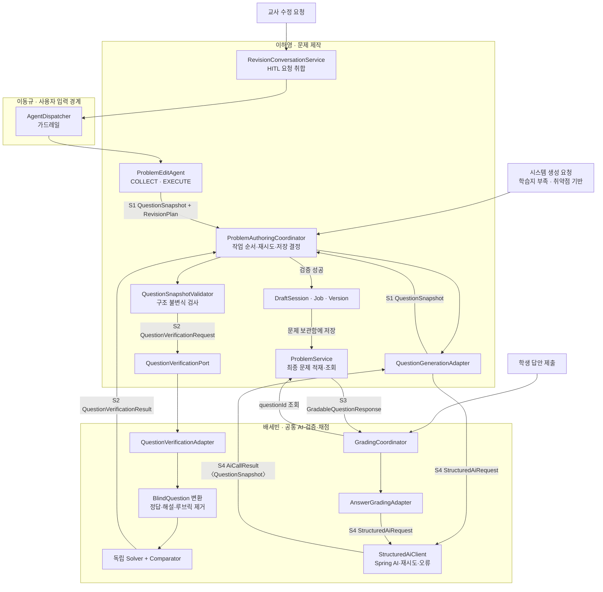

# 문제 생성·수정·검증·채점 에이전트 아키텍처 설계

- 작성일: 2026-08-14
- 상태: 팀 검토용 설계 초안
- 대상: 문제 생성·수정 담당 이하영, 문제 검증·채점 및 공통 AI Client 담당 배세빈
- 관련 담당: `AgentDispatcher` 및 공통 Agent 계약 담당 이동규

## 1. 목적

이 문서는 문제 생성·수정·검증·채점 기능을 현재 프로젝트 구조에 맞게 연결하고, 이하영과 배세빈이 병렬로 개발하기 전에 반드시 고정해야 할 공통 계약을 정의한다.

설계 목표는 다음과 같다.

1. 사용자 입력을 받는 문제 수정은 기존 `AgentDispatcher` 경계를 유지한다.
2. 시스템이 요청하는 문제 생성·검증·채점은 Dispatcher를 거치지 않는다.
3. Agent끼리 직접 호출하지 않고 도메인 Coordinator가 호출 순서를 결정한다.
4. 생성·수정 후보는 최종 승인 전까지 기존 문제 Entity에 적재하지 않는다.
5. 생성·수정 결과와 검증 입력 사이에 하나의 문제 스냅샷 규격을 사용한다.
6. 문제 검증과 학생 답안 채점은 기술 일부를 재사용하되 생명주기와 계약을 분리한다.
7. 각 계약 파일에는 한 명의 소유자를 지정한다.

## 2. 검토한 기존 설계에서 유지할 내용

배세빈이 먼저 작성한 `agent-architecture.md`에서 다음 아이디어는 유지한다.

- 저작 결과와 검증 입력 사이에 DB Entity가 아닌 값 객체를 사용한다.
- 스냅샷 내부 참조에는 DB ID 대신 `C1`, `S1`, `B1`, `R1` 같은 논리 키를 사용한다.
- 검증 Solver에는 정답·해설·루브릭을 제거한 Blind 입력만 전달한다.
- Solver 결과와 저작측 정답 비교를 분리한다.
- 문제 유형별 비교 방법인 `CHOICE`, `VALUE`, `EXACT`, `SET`, `SUBST`, `RUBRIC`을 유지한다.
- 상대 구현이 없어도 개발할 수 있도록 Fake와 공통 JSON 예제를 제공한다.
- JSON 구조 오류 재시도와 문제 정답 불일치 재생성을 구분한다.

## 3. 현재 구조에 맞게 변경할 내용

| 기존 구상 | 현재 권장 구조 |
|---|---|
| 공동 `QuestionPipelineOrchestrator` | 이하영 소유 `ProblemAuthoringCoordinator` |
| 생성·수정·검증·채점을 하나의 파이프라인으로 취급 | 문제 제작 워크플로와 학생 채점 워크플로 분리 |
| 생성 문제를 즉시 `problem_*` 테이블에 적재 | Session·Version에 후보로 보관하고 문제 보관함 저장 시 최종 적재 |
| 수정 후보 3~4개를 만든 뒤 교사가 선택 | HITL 대화로 요청을 취합한 뒤 한 개 수정 후보 생성 |
| 후보별 `SELECTED`·`REJECTED` 버튼 | 명시적 승인·거절 버튼 없이 현재 Version을 사용 |
| 수정 후보 선택 즉시 새 문제 저장 | `문제 보관함에 저장` 시 최종 문제로 적재 |
| 루브릭 전용 대화 세션 | 우선 일반 문제 수정 대화에서 루브릭도 수정 가능하게 구성 |
| `BlindQuestion`을 공통 계약으로 제공 | 배세빈 검증 구현 내부 타입으로 관리 |
| 전체 `solverTrace` 반환 | 짧은 검증 근거인 `evidenceSummary`만 반환 |
| `com.cenedu.agent` 공동 패키지 | 현재 루트 `com.cenedu.backend`와 패키지 소유 규칙 준수 |

## 4. 핵심 아키텍처 원칙

### 4.1 공통 꼭지는 LLM Agent가 아니라 Coordinator다

생성·수정·검증·채점 중 무엇을 호출해야 하는지는 대부분 이미 시스템 상태로 결정된다.

- 문제 수가 부족하면 생성한다.
- 교사가 수정 요청을 확정하면 수정한다.
- 생성·수정 후보가 나오면 검증한다.
- 학생 답안이 제출되면 채점한다.

이 결정을 다시 LLM에게 맡기면 비용과 실패 가능성만 증가한다. 따라서 문제 제작의 공통 꼭지는 일반 서비스인 `ProblemAuthoringCoordinator`로 둔다.

### 4.2 문제 제작과 학생 채점은 분리한다

문제 검증과 채점은 답 비교 기술을 일부 공유할 수 있지만 실행 시점이 다르다.

- 문제 검증: 생성·수정된 문제 후보가 올바른지 검사한다.
- 학생 채점: 학생이 제출한 답안을 저장된 문제 정답과 비교한다.

문제 제작 워크플로에는 학생 답안이 없으므로 채점 Agent를 호출하지 않는다.

### 4.3 Agent끼리 직접 호출하지 않는다

- `ProblemEditAgent`가 검증 Agent를 직접 호출하지 않는다.
- 검증 Adapter가 생성 Agent를 직접 호출하지 않는다.
- Agent가 `AgentDispatcher`를 주입받지 않는다.
- Coordinator가 각 Port와 Dispatcher를 호출하고 결과를 해석한다.

### 4.4 사용자 입력과 시스템 요청을 구분한다

- 교사의 실제 수정 문장: `AgentDispatcher`를 거쳐 `PROBLEM_EDIT`로 전달한다.
- 학습지 부족·취약점 기반 문제 생성: 시스템 요청이므로 Dispatcher를 거치지 않는다.
- 생성·수정 결과 검증: 시스템 요청이므로 Dispatcher를 거치지 않는다.
- 학생 답안 자동 채점: 시스템 요청이므로 Dispatcher를 거치지 않는다.

## 5. 전체 구성



## 6. 사용자 수정 HITL 흐름

수정 과정은 `COLLECT`와 `EXECUTE` 두 단계로 나눈다. 두 단계 모두 `AgentKind.PROBLEM_EDIT` 하나를 사용한다.

1. 교사가 문제 전체·보기·해설 등의 초기 수정 영역을 선택한다.
2. 선택 영역은 수정 가능 범위를 제한하지 않고 `initialTargetSection` 힌트로 사용한다.
3. 교사의 현재 문장과 대화 이력, 현재 `RevisionPlan`을 Dispatcher에 전달한다.
4. Agent는 수정 요청을 구조화하고 추가 수정 여부를 질문한다.
5. 교사가 “이제 없어”라고 답하면 Agent가 전체 수정 계획을 요약한다.
6. Agent가 “이대로 수정할까요?”라고 최종 확인한다.
7. 교사가 “네, 수정해줘”라고 확인하면 비동기 Job을 생성한다.
8. Worker가 `PROBLEM_EDIT / EXECUTE`를 호출해 수정 후보 스냅샷을 만든다.
9. 로컬 구조 검사와 외부 문제 검증을 수행한다.
10. 성공한 결과만 새 Version으로 저장하고 Session의 현재 Version을 변경한다.

`ProblemEditAgent`는 대화 이력을 저장하지 않는다. `RevisionConversationService`가 저장한 이력을 매 요청의 `AgentRequest.history()`로 전달한다.

## 7. 생성 흐름

문제 생성은 다음 경우에만 시스템이 호출한다.

1. 학습지를 구성할 문제 수가 부족한 경우
2. 취약점 기반 문제 생성에서 임베딩 유사문제 수가 부족한 경우
3. 틀린 문제를 기반으로 응용문제를 완전 생성하는 경우

생성 목적은 이하영 내부 enum으로 관리한다.

```text
INVENTORY_SHORTFALL
WEAKNESS_SIMILAR
WEAKNESS_ADVANCED
```

생성 결과는 즉시 `problem_question`에 저장하지 않는다.

```text
GenerationCommand
→ QuestionSnapshotV1
→ QuestionSnapshotValidator
→ QuestionVerificationPort
→ 검증 성공
→ DraftSession의 V1
→ 미리보기
→ 문제 보관함에 저장
→ Problem Entity 적재
```

여러 문제를 생성할 때는 문항별 파이프라인을 사용한다.

```text
문항 1 생성 완료 → 문항 1 검증
                  ↘ 문항 2 생성 진행
```

같은 후보의 최종 검증은 후보 생성이 끝난 후에만 가능하다. 여러 문항 사이에서는 생성과 검증을 파이프라인 형태로 겹칠 수 있다.

## 8. Session·Job·Version

### 8.1 DraftSession

문제 한 개를 생성하거나 수정하는 전체 작업 여정을 나타낸다.

주요 정보:

- 소유 교사 ID
- 기준 문제 ID 또는 생성 목적
- 현재 Version ID
- 최종 적재된 문제 ID
- 상태: `ACTIVE`, `COMPLETED`, `CANCELLED`

### 8.2 RevisionJob

한 번의 확정된 수정 요청과 비동기 처리 상태를 나타낸다.

권장 상태:

```text
COLLECTING
AWAITING_CONFIRMATION
QUEUED
REVISING
VERIFYING
SUCCEEDED
FAILED
CANCELLED
```

한 Session에는 동시에 하나의 `QUEUED`, `REVISING`, `VERIFYING` Job만 허용한다.

### 8.3 Version

구조 검사와 문제 검증을 통과한 불변 스냅샷이다.

- V1: 최초 생성 후보 또는 기존 문제 스냅샷
- V2: 첫 번째 수정 성공 결과
- V3: 두 번째 수정 성공 결과

복원은 Version 행을 복사하지 않고 Session의 `currentVersionId`를 이동한다. 복원된 Version에서 다시 수정하면 새로운 Version으로 분기한다.

## 9. 공통 스키마

### 9.1 S1 — `QuestionSnapshotV1`

저작 결과, 검증 입력, Version 저장에 사용하는 문제 후보의 정본 구조다.

소유자는 이하영이며 배세빈은 읽기 계약을 사용한다.

```text
QuestionSnapshotV1
├─ schemaVersion
├─ metadata
│  ├─ subUnitId
│  ├─ difficulty
│  ├─ questionType
│  ├─ presentation
│  └─ derivedFromQuestionId
├─ contentBlocks
├─ assetReferences
├─ choices
│  ├─ choiceKey
│  ├─ displayOrder
│  └─ content
├─ steps
│  ├─ stepKey
│  └─ segments
├─ answerUnits
│  ├─ unitKey
│  ├─ stepKey
│  ├─ answerRaw
│  ├─ answerNormalized
│  └─ compareMethod
├─ essay
│  ├─ modelAnswer
│  └─ rubricItems
├─ explanation
├─ learningGuide
└─ hintText
```

#### 공통 불변식

1. `schemaVersion`은 필수다.
2. 목록의 `displayOrder`는 0부터 연속한다.
3. 논리 키는 한 문제 안에서 중복되지 않는다.
4. Segment의 `unitKey`는 존재하는 AnswerUnit을 참조한다.
5. AnswerUnit의 `stepKey`는 존재하는 Step을 참조한다.
6. 객관식·단답형·서술형은 기본적으로 `MAIN` AnswerUnit 하나를 갖는다.
7. 객관식은 보기가 두 개 이상이어야 한다.
8. 객관식 정답은 보기 순번이 아니라 `choiceKey`로 표현한다.
9. 서술형은 `modelAnswer`와 한 개 이상의 rubric item을 갖는다.
10. 수정 후보는 원본의 asset을 참조할 수 있지만 MVP에서 이미지 자체를 수정하지 않는다.
11. 내부 스토리지 키와 서명 URL은 Snapshot에 저장하지 않는다.

#### 유형별 구성

| 유형 | 필수 구성 |
|---|---|
| `MULTIPLE_CHOICE` | choices, `MAIN` answer의 `choiceKey` |
| `SHORT_INPUT` | `MAIN` answer의 원문·정규화 정답·비교 방법 |
| `STEP_FILL` | steps, segments, 하나 이상의 answerUnits |
| `ESSAY` | `modelAnswer`, rubricItems, `RUBRIC` 비교 방법 |

### 9.2 S2 — `QuestionVerificationRequest`

이하영의 문제 제작 Coordinator가 배세빈의 검증 구현에 넘기는 요청이다.

```text
QuestionVerificationRequest
├─ requestId
├─ purpose: GENERATED | EDITED
├─ attempt
├─ snapshot: QuestionSnapshotV1
└─ context
   ├─ curriculumScope
   └─ assetDescriptions
```

`curriculumScope`는 소단원 ID만 전달하는 것보다 검증에 필요한 범위 설명을 함께 제공한다. 검증 구현이 curriculum Repository를 직접 조회하지 않게 한다.

이미지가 필요한 문제는 스토리지 키가 아닌 안전한 설명 또는 별도 검증용 asset 입력을 사용한다. 이미지 내용을 확인할 수 없는 `WITH_FIGURE` 문제는 검증기가 성공으로 추정하지 않고 `UNVERIFIABLE`로 반환한다.

### 9.3 S2 — `QuestionVerificationResult`

```text
QuestionVerificationResult
├─ status
│  ├─ PASSED
│  ├─ MISMATCH
│  ├─ UNVERIFIABLE
│  └─ ERROR
├─ unitResults
│  ├─ unitKey
│  ├─ equivalent
│  ├─ computedAnswer
│  └─ evidenceSummary
├─ rubricIssues
└─ issues
   ├─ code
   ├─ severity
   ├─ targetPath
   ├─ message
   └─ repairHint
```

상태 의미:

- `PASSED`: 정답·해설·풀이 가능성·루브릭 검사를 통과했다.
- `MISMATCH`: 계산된 답과 주장한 정답이 일치하지 않거나 구성 요소가 모순된다.
- `UNVERIFIABLE`: 입력 정보 또는 현재 검증 능력으로 판정할 수 없다.
- `ERROR`: Provider 장애, 파싱 실패 등 검증 실행 자체가 실패했다.

`PENDING`은 검증 결과가 아니라 Job 상태로 관리한다. `RUBRIC_INCOHERENT`는 전체 상태로 만들지 않고 rubric issue로 표현한다.

배세빈의 검증 구현은 결과만 반환한다. Version 생성, currentVersion 변경, 재시도 여부 결정은 이하영 Coordinator의 책임이다.

### 9.4 Blind 검증 입력

`BlindQuestion`은 배세빈의 검증 구현 내부 타입이다. 다음 정보가 제거되어야 한다.

- 정답 원문과 정규화 정답
- 정답 choiceKey
- 해설
- learning guide
- hint
- 모범 답안
- rubric item

Solver는 Blind 입력만 받고, Comparator만 Solver 결과와 주장 정답을 함께 받는다.

전체 풀이 사고 과정을 외부 계약으로 반환하지 않는다. 교사에게 보여줄 수 있는 짧은 판정 근거만 `evidenceSummary`로 반환한다.

### 9.5 S3 — `GradableQuestionResponse`

저장된 문제를 배세빈의 채점 서비스에 제공하는 problem 도메인 공개 DTO다.

```text
GradableQuestionResponse
├─ questionId
├─ questionType
├─ answerUnits
│  ├─ answerUnitId
│  ├─ unitKey
│  ├─ answerRaw
│  ├─ answerNormalized
│  └─ compareMethod
├─ choices
│  ├─ choiceId
│  └─ displayOrder
├─ modelAnswer
└─ rubricItems
   ├─ rubricItemId
   ├─ label
   └─ weight
```

S1과 달리 실제 채점 및 결과 저장에 필요한 DB ID를 포함한다.

- `SubmissionAnswer.answerUnitId`
- 객관식의 `selectedChoiceId`
- `GradingRubricResult.rubricItemId`

채점 도메인은 Problem Repository나 Problem Entity를 직접 참조하지 않고 ProblemService의 public 메서드로 이 응답을 조회한다.

### 9.6 S4 — `StructuredAiClient`

배세빈이 소유하는 Spring AI 공통 호출 계약이다.

```text
StructuredAiRequest
├─ useCase
├─ systemPrompt
├─ messages
├─ responseType
└─ traceId

AiCallResult<T>
├─ data
├─ tokenUsage
├─ finishReason
└─ errorType
```

공통 오류 타입:

```text
TIMEOUT
RATE_LIMIT
INVALID_STRUCTURED_OUTPUT
SAFETY_BLOCKED
PROVIDER_ERROR
```

Spring AI의 구조화 출력 파싱, Provider 재시도, 토큰 기록, timeout과 Provider 예외 변환은 공통 Client가 담당한다.

문제 불일치에 따른 재생성은 Provider 재시도와 별개이며 `ProblemAuthoringCoordinator`가 담당한다.

## 10. 검증과 채점의 관계

배세빈 구현 내부에서 정답 비교기를 재사용할 수 있다.

```text
검증
BlindQuestion → Solver → ComputedAnswer → Comparator → VerificationResult

채점
StudentAnswer + GradableQuestionResponse → Comparator 또는 RubricGrader → Score
```

재사용 가능한 기술:

- LaTeX 정규화
- 수치 비교
- 집합 순서 무관 비교
- 표현식 동치 판정
- 객관식 보기 비교
- 루브릭 항목별 판정 형식

검증 결과와 채점 결과 타입은 합치지 않는다. 검증은 문제 후보를 판정하고 채점은 학생 답안을 판정하기 때문이다.

## 11. 패키지와 소유권 권장안

```text
com.cenedu.backend
├─ domain/problem/                         이하영
│  ├─ ai/model/QuestionSnapshotV1
│  ├─ service/port/QuestionVerificationPort
│  ├─ dto/response/GradableQuestionResponse
│  ├─ service/ProblemAuthoringCoordinator
│  ├─ service/QuestionSnapshotMapper
│  ├─ service/QuestionSnapshotValidator
│  └─ session · job · version 관련 타입
│
├─ ai/problem/                             이하영
│  ├─ ProblemEditAgent
│  └─ QuestionGenerationAdapter
│
├─ ai/verification/                        배세빈
│  └─ QuestionVerificationAdapter
│
├─ ai/client/                              배세빈
│  └─ StructuredAiClient
│
└─ domain/grading/                         배세빈
   ├─ GradingCoordinator
   └─ AnswerGradingAdapter
```

`ai/problem`과 `ai/verification`은 현재 `AGENTS.md`에 없는 패키지이므로 구현 전에 이동규를 포함해 소유 경계를 합의하고 문서에 반영한다.

`com.cenedu.agent.contract` 같은 공동 소유 패키지는 만들지 않는다. 공동으로 합의하는 타입도 실제 파일 소유자는 한 명으로 고정한다.

## 12. 계약 소유표

| 대상 | 파일 소유자 | 소비자 |
|---|---|---|
| `QuestionSnapshotV1` | 이하영 | 생성·수정·검증·Version Mapper |
| `QuestionVerificationPort` | 이하영 | ProblemAuthoringCoordinator |
| `QuestionVerificationRequest/Result` | 이하영 | 이하영·배세빈 |
| `QuestionVerificationAdapter` | 배세빈 | Port 구현 |
| `GradableQuestionResponse` | 이하영 | 배세빈 GradingCoordinator |
| `StructuredAiClient` | 배세빈 | 각 AI Adapter |
| `ProblemEditAgent` | 이하영 | AgentDispatcher |
| `AgentDispatcher`·`AgentRequest`·`AgentResponse` | 이동규 | 사용자 프롬프트 기능 담당자 |
| Session·Job·Version | 이하영 | 문제 제작 워크플로 |
| 채점 결과와 루브릭 판정 저장 | 배세빈 | grading 도메인 |

## 13. DB 적용 방향

### 13.1 추가할 문제 제작 테이블

- `problem_draft_session`
- `problem_draft_version`
- `problem_revision_job`
- 다중 턴 대화를 저장할 경우 `problem_revision_message`

Version은 검증된 불변 `QuestionSnapshotV1` JSON을 저장한다. 검증 전 임시 후보는 Job에 둘 수 있지만 Version으로 승격하지 않는다.

### 13.2 기존 문서에서 당장 추가하지 않을 테이블

- `agent_revision_candidate`
- `agent_rubric_session`
- `agent_rubric_message`

현재 UI는 후보 3~4개 중 하나를 고르는 방식이 아니며 루브릭만을 위한 별도 대화도 확정되지 않았다. 필요한 시점에 별도 기능으로 추가한다.

### 13.3 최종 문제 적재

`문제 보관함에 저장` 시점에 현재 Version을 다음 Entity로 변환한다.

- `ProblemQuestion`
- `ProblemChoice`
- `ProblemStep`
- `ProblemAnswerUnit`
- `ProblemRubricItem`
- 기존 asset 참조

수정 문제는 새 `ProblemQuestion`을 생성하고 `derivedFromQuestionId`로 원본을 연결한다. 기존 문제와 하위 Entity는 직접 수정하지 않는다.

## 14. 오류와 재시도

### 14.1 Provider 재시도

공통 `StructuredAiClient`가 담당한다.

- timeout
- rate limit
- 일시적 Provider 오류
- 구조화 출력 파싱 실패

### 14.2 문제 재생성

`ProblemAuthoringCoordinator`가 담당한다.

- `MISMATCH`: 검증 문제와 `repairHint`를 포함해 재생성 가능
- `UNVERIFIABLE`: 같은 요청을 그대로 반복하지 않고 사용자 또는 시스템 정책으로 종료
- `ERROR`: Provider 재시도 소진 후 Job 실패

기존 문서의 최대 2회 재생성 정책을 기본안으로 유지한다. 최초 생성은 재시도 횟수에 포함하지 않는다.

### 14.3 실패 시 보존 규칙

- 실패한 Job은 상태와 오류 코드, 검증 요약을 보존한다.
- 실패한 후보는 Version으로 생성하지 않는다.
- Session의 현재 Version을 변경하지 않는다.
- 기존 원본 문제를 수정하거나 삭제하지 않는다.

## 15. 동시성

- 한 Session에는 실행 중인 수정 Job을 하나만 허용한다.
- Job 생성 시 기준 Version ID를 저장한다.
- 실행 완료 시 기준 Version이 여전히 예상한 현재 Version인지 확인한다.
- 오래된 Job 결과는 현재 Version을 덮어쓰지 않는다.
- Session 또는 Job에 낙관적 잠금을 적용한다.
- AI 호출 중에는 DB 트랜잭션을 열어두지 않는다.
- 여러 문제 생성은 제한된 동시성으로 실행한다.
- 동일 후보의 생성과 최종 검증은 순차 실행한다.

## 16. 공통 계약 테스트

### 16.1 Snapshot 계약

- 네 문제 유형 JSON 직렬화·역직렬화
- 논리 키 중복 거부
- 잘못된 Step–AnswerUnit 참조 거부
- 객관식 정답 choiceKey 존재 검사
- 서술형 modelAnswer·rubric 존재 검사
- Snapshot에 storageKey와 서명 URL이 없는지 검사

### 16.2 Blind 입력

직렬화된 Blind 입력에 다음 값이 포함되지 않아야 한다.

- 정답
- 정답 choiceKey
- 정규화 정답
- 해설
- 모범 답안
- 루브릭
- 힌트

### 16.3 검증 Fake

동일한 입력에는 항상 동일한 결과를 반환한다.

- 정상 문제 → `PASSED`
- 정답 오류 → `MISMATCH`
- 시각 정보 부족 → `UNVERIFIABLE`
- Provider 실패 → `ERROR`
- 루브릭 누락·중복·범위 이탈 → rubric issue

### 16.4 워크플로

- 검증 실패 시 Version이 생성되지 않는다.
- 검증 성공 시 새 Version과 currentVersion이 갱신된다.
- Version 복원 후 수정하면 새 Version으로 분기한다.
- 문제 보관함 저장 전 `problem_question`이 생성되지 않는다.
- 저장 시 기존 문제 ID와 draftSessionId를 함께 처리할 수 있다.
- 최종 저장 실패 시 Worksheet와 Problem 적재가 함께 롤백된다.

### 16.5 채점 경계

- grading 도메인이 problem Repository를 직접 참조하지 않는다.
- `GradableQuestionResponse`의 answerUnitId와 rubricItemId로 결과를 저장한다.
- 객관식·단답형·빈칸형은 결정론적 채점을 우선한다.
- 서술형만 AI 루브릭 판정을 사용한다.

## 17. 주말 작업 전 계약 PR

각자 구현을 시작하기 전에 작은 계약 PR을 먼저 병합한다.

포함 범위:

1. `QuestionSnapshotV1`
2. `QuestionVerificationPort`
3. 검증 요청·결과 record와 enum
4. `GradableQuestionResponse`
5. `StructuredAiClient` 인터페이스
6. 객관식·단답형·빈칸형·서술형 JSON 예제 각 1개
7. Snapshot JSON 직렬화 테스트
8. Blind 입력 누출 방지 테스트 규격
9. 새 패키지 소유를 반영한 `AGENTS.md`

계약 PR에는 실제 프롬프트, DB 테이블, 실제 AI 호출 구현을 넣지 않는다.

## 18. 주말 병렬 작업

### 18.1 이하영

- 문제 유형별 `QuestionSnapshotV1` Mapper
- `QuestionSnapshotValidator`
- DraftSession·RevisionJob·Version
- HITL 수정 대화와 `RevisionPlan`
- `ProblemEditAgent`의 `COLLECT`·`EXECUTE`
- 시스템 문제 생성 Adapter
- `ProblemAuthoringCoordinator`
- Fake 검증기를 이용한 생성·수정 흐름
- 최종 Snapshot을 Problem Entity로 적재하는 Mapper

### 18.2 배세빈

- Spring AI 2.0 공통 Client
- 구조화 출력 및 Provider 재시도
- `QuestionVerificationAdapter`
- Blind 입력 변환
- Solver와 Comparator
- 객관식·수치·집합·수식 비교기
- 서술형 루브릭 검증
- `GradingCoordinator`
- Fake Snapshot을 이용한 검증·채점 테스트

### 18.3 통합 확인

1. 시스템 생성 → Snapshot → Fake 검증 → V1 생성
2. 수정 요청 수집 → 최종 확인 → 비동기 Job → 새 Version
3. MISMATCH → 재생성 → PASSED
4. 문제 보관함 저장 → Problem Entity 적재 → Worksheet Item 연결
5. 학생 제출 → GradableQuestionResponse 조회 → 객관식 채점
6. 학생 제출 → rubric 조회 → 서술형 채점 결과 저장

## 19. 구현 전 최종 결정 항목

### 19.1 검증 실패 후보의 최종 저장 허용 여부

권장 정책은 다음과 같다.

- AI 생성·수정 문제는 `PASSED`일 때만 Version으로 승격하고 최종 저장할 수 있다.
- `MISMATCH`는 재생성 상한 소진 후 Job을 실패 처리한다.
- `UNVERIFIABLE`은 경고와 실패 사유를 보여주되 최종 저장하지 않는다.
- 기존 IMPORTED 문제는 이 정책의 적용 대상이 아니다.

이 정책을 선택하면 품질 기준이 단순해지지만, 시스템 생성이 모두 실패했을 때 학습지 문항 수가 부족할 수 있다. 그 경우 원본 문제 유지, 기존 문제은행 재선택 또는 생성 실패 표시로 처리한다.

### 19.2 서술형 모범 답안 저장 위치

공통 Snapshot에서는 `modelAnswer`로 명확히 표현한다. 기존 DB의 `answer_raw` 사용과 별도 `model_answer` 컬럼 추가 중 하나는 Persistence Mapper 설계 전에 확정한다.

현재 코드 주석과 실제 적재 데이터의 의미가 일치하지 않으므로, 기존 상태를 그대로 계약에 노출하지 않는다.

### 19.3 Agent 패키지 소유

`ai/problem`과 `ai/verification`을 추가할지 이동규와 합의한다. 합의 전에는 이동규 소유 `ai/agent`와 `ai/dispatcher`에 파일을 추가하지 않는다.

## 20. 완료 기준

다음 조건이 모두 충족되면 설계 기준의 첫 구현이 완료된 것으로 본다.

- 공통 계약 PR이 먼저 병합된다.
- 네 문제 유형 Snapshot 계약 테스트가 통과한다.
- 생성·수정·검증·채점이 서로의 Repository를 직접 참조하지 않는다.
- 사용자 수정 원문은 반드시 Dispatcher를 통과한다.
- 시스템 생성·검증·채점은 Dispatcher를 사용하지 않는다.
- Agent끼리 직접 호출하지 않는다.
- AI 호출 중 DB 트랜잭션을 유지하지 않는다.
- 검증 실패 후보가 현재 Version을 덮어쓰지 않는다.
- 문제 보관함 저장 전 최종 Problem Entity가 생성되지 않는다.
- `./gradlew build`와 ArchUnit 테스트가 통과한다.

